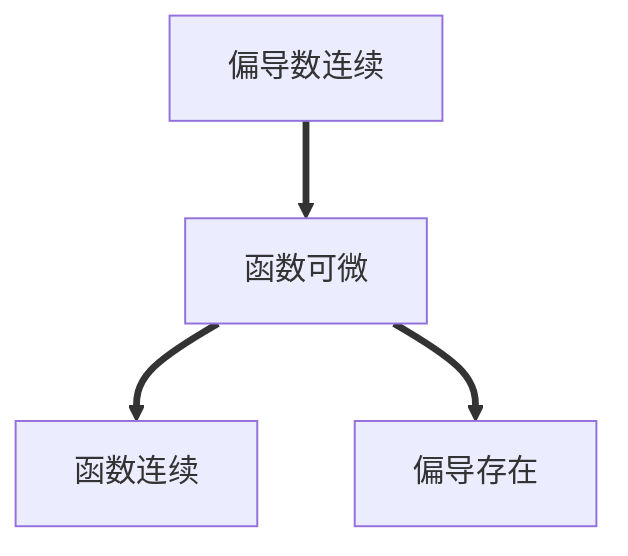

# 多元函数的概念

## 平面点集有关概念

- 邻域
- 区域(开区域、闭区域)
- 内点、外点、边界点
- 开集
- 连通集
- 有界集、无界集
- 聚点(点$P$的任意一个去心邻域总有点属于区域$E$，则称$P$为$E$的聚点)
- $n$维空间(记作$R^n$)

## 概念

### 二元函数的概念

设$D$是平面上的一个点集，则称映射$f:D\to R$为定义在$D$上的二元函数。

记为$z=f(x,y),\quad (x,y)\in D$。

## 极限

设函数$z=f(x,y)$的定义域为$D$，$P_0(x_0,y_0)$是其聚点，如果对于任意给定的正数$\epsilon$，总存在正数$\delta$，使得对于适合不等式$0<|PP_0|=\sqrt{(x-x_0)^2+(y-y_0)^2}<\delta$的一切点都有$|f(x,y)-A|<\epsilon$成立，则称$A$为函数$z=f(x,y)$当$x\to x_0,\quad y\to y_0$时的极限。记为$\lim_{x\to x_0,y\to y_0}f(x,y)$。

> **一元函数极限的定义**

> 对于函数$y=f(x)$在某一去心邻域内有定义，$x=x_0$是去心邻域的中点，如果对于任意给定的正数$\epsilon$，总存在正数$\delta$，使得对于适合不等式$0<|x-x_0|<\delta$的一切点都有$|f(x)-A|<\epsilon$成立，则称$A$为函数$y=f(x)$当$x\to x_0$时的极限。记为$\lim_{x\to x_0}f(x)$。

## 连续性

### 定义

设$n$元函数$f(x)$的定义域为点集$D$，$P_0$是其聚点且$P_0\in D$，如果$\lim_{P\to P_0}f(P)=f(P_0)$则称$n$元函数$f(P)$在点$P_0$处连续。

### 性质

#### 最大值和最小值定理

在有界闭区域$D$上的多元连续函数，在$D$上至少取得它的最大值和最小值各一次。

#### 介值定理

在有界闭区域$D$上的多元连续函数，如果在$D$上取得两个不同的函数值，则它在$D$上取得介于这两值之间的任何值至少一次。

## 多元初等函数

由常数及不同自变量的一元基本初等函数经过有限次的四则运算和复合步骤所构成的可用一个式子所表示的多元函数叫**多元初等函数**。

一切多元初等函数在其定义区域内是连续的。

# 偏导数与全微分

## 偏导数

### 定义

偏心的导数hhh。

### 偏导数存在与连续的关系

一元函数中某点可导$\to$连续。

多元函数中某点偏导数存在$\neq$连续。

### 几何意义

对$x$求偏导在$M_0$处的值是曲面上过$M_0$点与$xOz$平面平行的截面所截的曲线的切线对于$x$轴的斜率。

对$y$求偏导在$M_0$处的值是曲面上过$M_0$点与$yOz$平面平行的截面所截的曲线的切线对于$y$轴的斜率。

### 高阶偏导数

如果函数$z=f(x,y)$的两个两阶混合偏导数$\frac{\partial^2z}{\partial y\partial x}$及$\frac{\partial^2z}{\partial x\partial y}$在区域$D$内连续，那在该区域内这两个二阶混合偏导必相等。

## 全微分

如果函数$z=f(x,y)$在点$(x,y)$的全增量$\Delta z=f(x+\Delta x,y+\Delta y)-f(x,y)$可以表示为$\Delta z=A\Delta x+B\Delta y+o(\rho)$，其中$A,B$不依赖于$\Delta x,\Delta y$，而仅与$x,y$有关，$\rho=\sqrt{(\Delta x)^2+(\Delta y)^2}$，则称函数$z=f(x,y)$在点$(x,y)$可微分，$A\Delta x+B\Delta y$称为函数$z=f(x,y)$在点$(x,y)$的全微分，记为$dz$，即$dz=A\Delta x+B\Delta y$。

如果函数$z=f(x,y)$在点$(x,y)$可微分，则函数在该点连续。

### 可微的必要条件

如果函数$z=f(x,y)$在点$(x,y)$可微分，则该函数在$(x,y)$的偏导数$\frac{\partial z}{\partial x}$、$\frac{\partial z}{\partial y}$必存在，且函数$z=f(x,y)$在点$(x,y)$的全微分满足：

$dz=\frac{\partial z}{\partial x}d x+\frac{\partial z}{\partial y}dy$

该公式也可推广到更多元函数：$du=\frac{\partial u}{\partial x}d x+\frac{\partial u}{\partial y}dy+\frac{\partial u}{\partial z}dz$

**偏导数存在不是函数可微的充分条件**

### 可微的充分条件

如果函数$z=f(x,y)$的偏导数$\frac{\partial z}{\partial x}$、$\frac{\partial z}{\partial y}$在点$(x,y)$连续，则该函数在点$(x,y)$可微分。

### 全微分的计算

1. 先求$f_x'(x,y)、f_y'(x,y)$，判断$f(x,y)$的可微性。
2. $dz=f_x'(x,y)dx+f_y'(x,y)dy$

## 多元函数连续、可导、可微的关系

**注意：只可按箭头推导**

