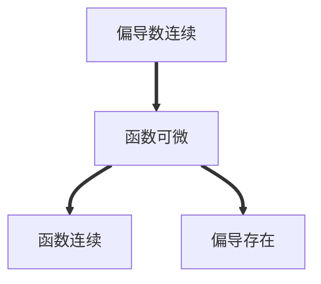
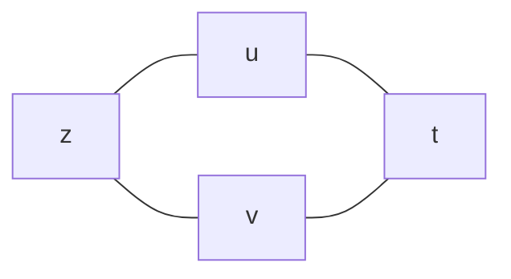
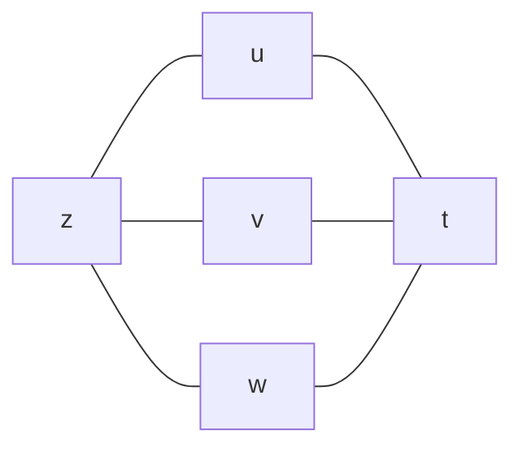
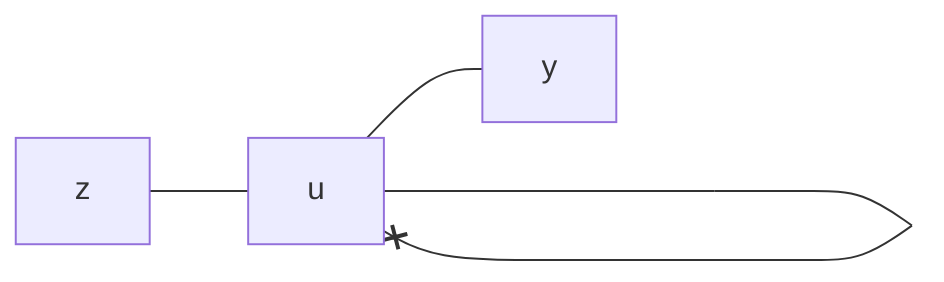
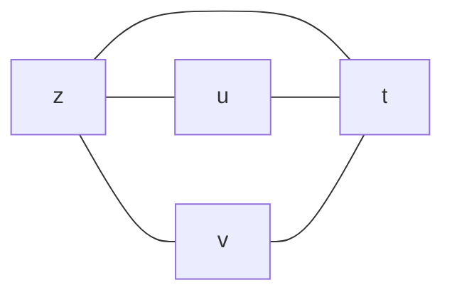
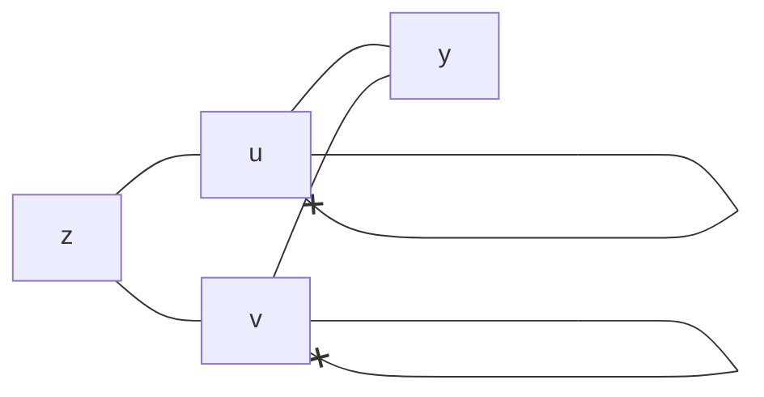
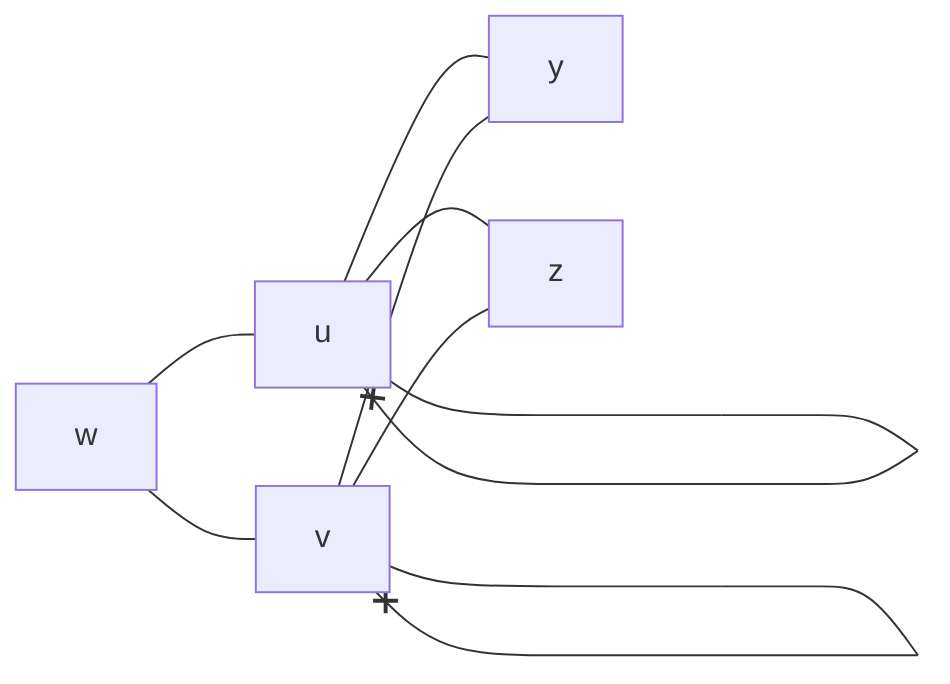

[toc]

# 多元函数的概念

## 平面点集有关概念

- 邻域
- 区域(开区域、闭区域)
- 内点、外点、边界点
- 开集
- 连通集
- 有界集、无界集
- 聚点(点$P$的任意一个去心邻域总有点属于区域$E$，则称$P$为$E$的聚点)
- $n$维空间(记作$R^n$)

## 概念

### 二元函数的概念

设$D$是平面上的一个点集，则称映射$f:D\to R$为定义在$D$上的二元函数。

记为$z=f(x,y),\quad (x,y)\in D$。

## 极限

设函数$z=f(x,y)$的定义域为$D$，$P_0(x_0,y_0)$是其聚点，如果对于任意给定的正数$\epsilon$，总存在正数$\delta$，使得对于适合不等式$0<|PP_0|=\sqrt{(x-x_0)^2+(y-y_0)^2}<\delta$的一切点都有$|f(x,y)-A|<\epsilon$成立，则称$A$为函数$z=f(x,y)$当$x\to x_0,\quad y\to y_0$时的极限。记为$\underset{x\to x_0,y\to y_0}{\lim}f(x,y)$。

> **一元函数极限的定义**

> 对于函数$y=f(x)$在某一去心邻域内有定义，$x=x_0$是去心邻域的中点，如果对于任意给定的正数$\epsilon$，总存在正数$\delta$，使得对于适合不等式$0<|x-x_0|<\delta$的一切点都有$|f(x)-A|<\epsilon$成立，则称$A$为函数$y=f(x)$当$x\to x_0$时的极限。记为$\underset{x\to x_0}{\lim}f(x)$。

## 连续性

### 定义

设$n$元函数$f(x)$的定义域为点集$D$，$P_0$是其聚点且$P_0\in D$，如果$\underset{P\to P_0}{\lim}f(P)=f(P_0)$则称$n$元函数$f(P)$在点$P_0$处连续。

### 性质

#### 最大值和最小值定理

在有界闭区域$D$上的多元连续函数，在$D$上至少取得它的最大值和最小值各一次。

#### 介值定理

在有界闭区域$D$上的多元连续函数，如果在$D$上取得两个不同的函数值，则它在$D$上取得介于这两值之间的任何值至少一次。

## 多元初等函数

由常数及不同自变量的一元基本初等函数经过有限次的四则运算和复合步骤所构成的可用一个式子所表示的多元函数叫**多元初等函数**。

一切多元初等函数在其定义区域内是连续的。

# 偏导数与全微分

## 偏导数

### 定义

偏心的导数hhh。

### 偏导数存在与连续的关系

一元函数中某点可导$\to$连续。

多元函数中某点偏导数存在$\neq$连续。

### 几何意义

对$x$求偏导在$M_0$处的值是曲面上过$M_0$点与$xOz$平面平行的截面所截的曲线的切线对于$x$轴的斜率。

对$y$求偏导在$M_0$处的值是曲面上过$M_0$点与$yOz$平面平行的截面所截的曲线的切线对于$y$轴的斜率。

### 高阶偏导数

如果函数$z=f(x,y)$的两个两阶混合偏导数$\frac{\partial^2z}{\partial y\partial x}$及$\frac{\partial^2z}{\partial x\partial y}$在区域$D$内连续，那在该区域内这两个二阶混合偏导必相等。

## 全微分

如果函数$z=f(x,y)$在点$(x,y)$的全增量$\Delta z=f(x+\Delta x,y+\Delta y)-f(x,y)$可以表示为$\Delta z=A\Delta x+B\Delta y+o(\rho)$，其中$A,B$不依赖于$\Delta x,\Delta y$，而仅与$x,y$有关，$\rho=\sqrt{(\Delta x)^2+(\Delta y)^2}$，则称函数$z=f(x,y)$在点$(x,y)$可微分，$A\Delta x+B\Delta y$称为函数$z=f(x,y)$在点$(x,y)$的全微分，记为$dz$，即$dz=A\Delta x+B\Delta y$。

如果函数$z=f(x,y)$在点$(x,y)$可微分，则函数在该点连续。

### 可微的必要条件

如果函数$z=f(x,y)$在点$(x,y)$可微分，则该函数在$(x,y)$的偏导数$\frac{\partial z}{\partial x}$、$\frac{\partial z}{\partial y}$必存在，且函数$z=f(x,y)$在点$(x,y)$的全微分满足：

$dz=\frac{\partial z}{\partial x}d x+\frac{\partial z}{\partial y}dy$

该公式也可推广到更多元函数：$du=\frac{\partial u}{\partial x}d x+\frac{\partial u}{\partial y}dy+\frac{\partial u}{\partial z}dz$

**偏导数存在不是函数可微的充分条件**

### 可微的充分条件

如果函数$z=f(x,y)$的偏导数$\frac{\partial z}{\partial x}$、$\frac{\partial z}{\partial y}$在点$(x,y)$连续，则该函数在点$(x,y)$可微分。

### 全微分的计算

1. 先求$f_x'(x,y)、f_y'(x,y)$，判断$f(x,y)$的可微性。
2. $dz=f_x'(x,y)dx+f_y'(x,y)dy$

## 多元函数连续、可导、可微的关系

**注意：只可按箭头推导**

# 多元复合函数求导法

## 多元与一元的复合

### 只有一个自变量

$u=\psi(t)$与$v=\phi(t)$都在点$t$可导，函数$z=f(u,v)$在点$(u,v)$具有连续偏导数，则$z=f[\psi(t),\phi(t)]$在点$t$可导，且其导数可用下列公式计算：

$\frac{dz}{dt}=\frac{\partial z}{\partial u}\frac{du}{dt}+\frac{\partial z}{\partial v}\frac{dv}{dt}$

也可推广到多个中间变量：

$\frac{dz}{dt}=\frac{\partial z}{\partial u}\frac{du}{dt}+\frac{\partial z}{\partial v}\frac{dv}{dt}+\frac{\partial z}{\partial w}\frac{dw}{dt}$

### 只有一个中间变量

$z=f(u),u=\phi(x,y)$ 则复合函数$z=f[\phi(x,y)]$

$\frac{\partial z}{\partial x}=\frac{dz}{du}\frac{\partial u}{\partial x}=f'(u)\phi'_x$

$\frac{\partial z}{\partial y}=\frac{dz}{du}\frac{\partial u}{\partial y}=f'(u)\phi'_y$

### 例题

$z=uv+\sin t$，而$u=e^t,v=\cos t$，求全导数$\frac{dz}{dt}$

$\frac{dz}{dt}=\frac{\partial z}{\partial u}\frac{du}{dt}+\frac{\partial z}{\partial v}\frac{dv}{dt}+\frac{\partial z}{\partial t}$

## 多元函数与多元函数复合

$\frac{\partial z}{\partial x}=f'_u\cdot u'_x+f'_v\cdot v'_x$

$\frac{\partial z}{\partial y}=f'_u\cdot u'_y+f'_v\cdot v'_y$

### 例题

设$w=f(x+y+z,xyz)$，求$\frac{\partial^2w}{\partial x\partial z}$。

解：设$u=x+y+z\quad v=xyz$后即可转换为：

## 全微分

不论$z$是自变量$u,v$的函数，或是中间变量$u,v$的函数，它的全微分形式都是一样的。

$dz=\frac{\partial z}{\partial u}du+\frac{\partial z}{\partial v}dv$

这个性质叫做全微分的不变性。

# 隐函数求导法

## 一个方程

### F(x,y)=0

当$F(x,y)$满足一下条件时：

1. 具有连续的偏导数
2. $F(x_0,y_0)=0$
3. $F'_y(x_0,y_0)\neq0$

有$\frac{dy}{dx}=-\frac{F‘_x}{F’_y}$

还可以求二阶导数：$\frac{d^2y}{dx^2}=-\frac{F_y'(F''_{xx}+F''_{xy})-F'_x(F''_{yx}+F''_{yy}\frac{dy}{dx})}{{F'_y}^2}$

$\qquad==-\frac{F_y'^2F''_{xx}-2F''_{xy}F'_xF_y'-F_x'^2F''_{yy}}{{F'_y}^3}$

### F(x,y,z)=0

当$F(x,y)$满足一下条件时：

1. 具有连续的偏导数
2. $F(x_0,y_0,z_0)=0$
3. $F'_y(x_0,y_0，z_0)\neq0$

有$\frac{\partial z}{\partial x}=-\frac{F‘_x}{F’_z}\quad\frac{\partial z}{\partial y}=-\frac{F‘_y}{F’_z}$

## 方程组

$$
\begin{cases}
F(x,y,u(x,y),v(x,y))=0\\
G(x,y,u(x,y),v(x,y))=0
\end{cases}
$$

求$\frac{\partial u}{\partial x},\frac{\partial u}{\partial y},\frac{\partial v}{\partial x},\frac{\partial v}{\partial y}$。
$$
J=\frac{\part(F,G)}{\part(F,G)}=
\left| \begin{matrix} 
F'_u &F'_v\\
G'_u &G'_v
\end{matrix} \right|
$$
称$J$为雅可比行列式，当$J\neq0$且偏导连续时有：
$$
\begin{cases}
\frac{\part u}{\part x}=-\frac{1}{J}\frac{\part(F,G)}{\part(x,v)}=-\frac{
\left|\begin{matrix}
F_x &F_v\\
G_x &G_v
\end{matrix}\right|
}{
\left|\begin{matrix}
F_u &F_v\\
G_u &G_v
\end{matrix}\right|
}\\
\frac{\part v}{\part x}=-\frac{1}{J}\frac{\part(F,G)}{\part(u,x)}=-\frac{
\left|\begin{matrix}
F_u &F_x\\
G_u &G_x
\end{matrix}\right|
}{
\left|\begin{matrix}
F_u &F_v\\
G_u &G_v
\end{matrix}\right|
}\\
\frac{\part u}{\part y}=-\frac{1}{J}\frac{\part(F,G)}{\part(y,v)}=-\frac{
\left|\begin{matrix}
F_y &F_v\\
G_y &G_v
\end{matrix}\right|
}{
\left|\begin{matrix}
F_u &F_v\\
G_u &G_v
\end{matrix}\right|
}\\
\frac{\part v}{\part y}=-\frac{1}{J}\frac{\part(F,G)}{\part(u,y)}=-\frac{
\left|\begin{matrix}
F_u &F_y\\
G_u &G_y
\end{matrix}\right|
}{
\left|\begin{matrix}
F_u &F_v\\
G_u &G_v
\end{matrix}\right|
}\\
\end{cases}
$$
记忆方法：只记$-\frac{}{\left|\begin{matrix}
F_u &F_v\\
G_u &G_v
\end{matrix}\right|}$，求$\frac{\part u}{\part x}$则将分母的$u$换成$x$后作为分子。以此类推。

# 多元函数微分学的几何应用

## 空间曲线的切线与法平面

### 参数方程

设空间曲线方程$\begin{cases}x=\phi(t)\\y=\psi(t)\\z=\omega(t)\end{cases}$

其切向量为$[\phi'(t_0),\psi'(t_0),\omega'(t_0)]$

法平面为$\phi'(t_0)(x-x_0)+\psi'(t_0)(y-y_0)+\omega'(t_0)(z-z_0)=0$

### 交面方程

$\Gamma:\begin{cases}F(x,y,z)=0\\G(x,y,z)=0\end{cases}\quad(1)$

点$M_0(x_0,y_0,z_0)$是$\Gamma$上一点，又设$F,G$对各变量有连续偏导数，且$\left|\begin{matrix}F_y &F_z\\G_y &G_z\end{matrix}\right|\neq 0$，设$y=\phi(x),z=\psi(x)$则有：
$$
\frac{dy}{dx}=\frac{
\left|\begin{matrix}
F_z &F_x\\
G_z &G_x
\end{matrix}\right|
}{
\left|\begin{matrix}
F_y &F_z\\
G_y &G_z
\end{matrix}\right|
}=\phi'(x)\\
\frac{dz}{dx}=\frac{
\left|\begin{matrix}
F_x &F_y\\
G_x &G_y
\end{matrix}\right|
}{
\left|\begin{matrix}
F_y &F_z\\
G_y &G_z
\end{matrix}\right|
}=\psi'(x)
$$
**切向量**$\vec T_1=\{1,\phi'(x_0),\psi'(x_0)\}=\{\left|\begin{matrix}
F_y &F_z\\
G_y &G_z
\end{matrix}\right|,\left|\begin{matrix}
F_z &F_x\\
G_z &G_x
\end{matrix}\right|,\left|\begin{matrix}
F_x &F_y\\
G_x &G_y
\end{matrix}\right|\}$

**切线方程**为$\frac{x-x_0}{\left|\begin{matrix}
F_y &F_z\\
G_y &G_z
\end{matrix}\right|}=\frac{y-y_0}{\left|\begin{matrix}
F_z &F_x\\
G_z &G_x
\end{matrix}\right|}=\frac{z-z_0}{\left|\begin{matrix}
F_x &F_y\\
G_x &G_y
\end{matrix}\right|}$，若分母为零则分子必须为零。

**法平面方程**为$\left|\begin{matrix}
F_y &F_z\\
G_y &G_z
\end{matrix}\right|(x-x_0)+\left|\begin{matrix}
F_z &F_x\\
G_z &G_x
\end{matrix}\right|(y-y_0)+\left|\begin{matrix}
F_x &F_y\\
G_x &G_y
\end{matrix}\right|(z-z_0)=0$

## 空间曲面的切平面与法线

### F(x,y,z)=0

设点$M_0=(x_0,y_0,z_0)$

**切面方程**为$F'_x(M_0)(x-x_0)+F'_y(M_0)+F'_z(M_0)(z-z_0)=0$

**法线方程**为$\frac{x-x_0}{F'_x(M_0)}=\frac{y-y_0}{F'_y(M_0)}=\frac{z-z_0}{F'_z(M_0)}$

一个**法向量**为$\vec n=\{F'_x(M_0),F'_y(M_0),F'_z(M_0)\}$

### z=f(x,y)

设$F(x,y,z)=f(x,y)-z$可得切平面方程为$f'_x(x_0,y_0)(x-x_0)+f'_y(x_0,y_0)(y-y_0)=z-z_0$

法向量为$\vec n=\{f'_x,f'_y,-1\}_{M_0}$或$\{-f'_x,-f'_y,1\}_{M_0}$

### 全微分的几何意义

当$z=f(x,y)$时的切面方程$f'_x(x_0,y_0)(x-x_0)+f'_y(x_0,y_0)(y-y_0)=z-z_0$

即$F'_xdx+F'_ydy=dz$，所以全微分表示曲面$z=f(x,y)$在点$(x_0,y_0,z_0)$处的切平面上的点的竖坐标的增量。

### 曲面法向量的方向角、方向余弦

设曲面的方程为$z=f(x,y)$，假定其法向量的方向是向上的，则$\vec n=\{-f_x,-f_y,1\}$，其方向余弦为：
$$
\cos\alpha=\frac{-f'_x}{\sqrt{1+{f'_x}^2+{f'_y}^2}}\\
\cos\beta=\frac{-f'_y}{\sqrt{1+{f'_x}^2+{f'_y}^2}}\\
\cos\gamma=\frac{1}{\sqrt{1+{f'_x}^2+{f'_y}^2}}
$$

# 方向导数与梯度

## 方向导数

### 定义

函数的增量$f(x+\Delta x,y+\Delta y)-f(x,y)$与$P,P'$两点间的距离即$\rho=\sqrt{(\Delta x)^2+(\Delta y)^2}$的比值，当$P'$沿着l趋于$P$时，如果这个比的极限存在，则称这个极限为函数$f(x,y)$在$p$点沿方向$l$的方向导数，记作$\frac{\part f}{\part \vec l}$。

### 与偏导数的关系

当$f(x,y)$在点$P(x,y)$的偏导数$f_x,f_y$存在时，设$\vec e_1=\{1,0\},\quad$$\vec e_2=\{0,1\}$，则$\frac{\part f}{\part \vec e_1}=\frac{\part f}{\part x}$，同理$\frac{\part f}{\part \vec e_2}=\frac{\part f}{\part y}$。

注意：**即使沿任意方向的方向导数都存在，也不能保证$f_x,f_y$存在。**

### 计算方法

$\frac{\part f}{\part \vec l}=\frac{\part f}{\part x}\cos\phi+\frac{\part f}{\part y}\sin\phi=\frac{\part f}{\part x}\cos\alpha+\frac{\part f}{\part y}\sin\beta$

其中$\phi$为与$x$轴的夹角，$\alpha,\beta$为方向角。

推广至三元函数可得：

$\frac{\part f}{\part \vec l}=\frac{\part f}{\part x}\cos\alpha+\frac{\part f}{\part y}\sin\beta+\frac{\part f}{\part z}\sin\gamma$

$\alpha,\beta,\gamma$为方向角。

## 梯度

### 定义

梯度是一个向量

记作$gradf(x,y)=\{\frac{\part f}{\part x},\frac{\part f}{\part y}\},gradf(x,y,z)=\{\frac{\part f}{\part x},\frac{\part f}{\part y},\frac{\part f}{\part z}\}$

### 性质

函数$z=f(x,y[,z])$在某点$P(x,y[,z])$处沿着梯度方向的方向导数最大(函数增长最快)，而它的最大值为梯度的模。

### 几何意义

函数在一条线(二元)或一个面(三元)上，垂直于该点等值线(二元)或等值面(三元)的法向量，指向函数增大的方向。

# 多元函数的极值及求法

## 多元函数的极值

### 定义

类比一元函数...

### 取得极值的必要条件

如果$f(x,y)$在点$(x_0,y_0)$处有偏导数，则 $f'_x(x_0,y_0)=0$$f'_y(x_0,y_0)=0$，三元函数类推

注意：

1. 驻点不一定是极值点
2. 极值点不一定是驻点，有可能是偏导数不存在的点

### 极值点的充分条件

当二阶偏导存在且一阶偏导为零时，设$f_{xx}(x_0,y_0)=A$,$f_{xy}(x_0,y_0)=B$,$f_{yy}(x_0,y_0)=C$，则$f(x,y)$在$(x_0,y_0)$处：

- $AC-B^2>0$时有极值，且当$A<0$时有极大值，$A>0$为极小值。
- $AC-B^2<0$时没有极值。
- $AC-B^2$时可能有极值也可能没有极值。

### 求极值的步骤

1. 求驻点，即解方程组$\begin{cases}f_x(x,y)=0\\f_y(x,y)=0\end{cases}$
2. 在每个驻点处求$A,B,C$
3. 由定理判断

### 多元函数的最值

可疑的极值点$\begin{cases}驻点(内部)\\边界上的最值点\end{cases}$

特别地，当区域内部最值存在，且只有一个极值点$P$时，极值点即最值点。

## 条件极值，拉格朗日乘数法

### 条件极值

实际问题中，有时会对函数的自变量另有附加条件，这类极值称为条件极值。

例如：求表面积为$a^2$的体积最大的长方体。目标函数：$z=xyz$，附加条件：$2(xy+yz+zx)=a^2$。

### 拉格朗日乘数法

要找函数$z=f(x,y)$在附加条件$\phi(x,y)=0$下可能的极值点，先构造辅助函数$F(x,y)=f(x,y)+\lambda\phi(x,y)$

解方程组$\begin{cases}F'_x=0\\F'_y=0\\\phi(x,y)=0\end{cases}$

这组方程组解出的$x,y,\lambda$，其中的$x,y$就是函数$f(x,y)$在附加条件$\phi(x,y)=0$下可能的极值点。

### 推广

可推广到三元函数$\begin{cases}F'_x=0\\F'_y=0\\F'_z=0\\\phi(x,y,z)=0\end{cases}$

还可推广到自变量多个而条件一个的情况$F(x,y)=f(x,y)+\lambda_1\phi(x,y)+\lambda_2\psi(x,y)$，$\begin{cases}F'_x=0\\F'_y=0\\\phi(x,y)=0\\\psi(x,y)=0\end{cases}$